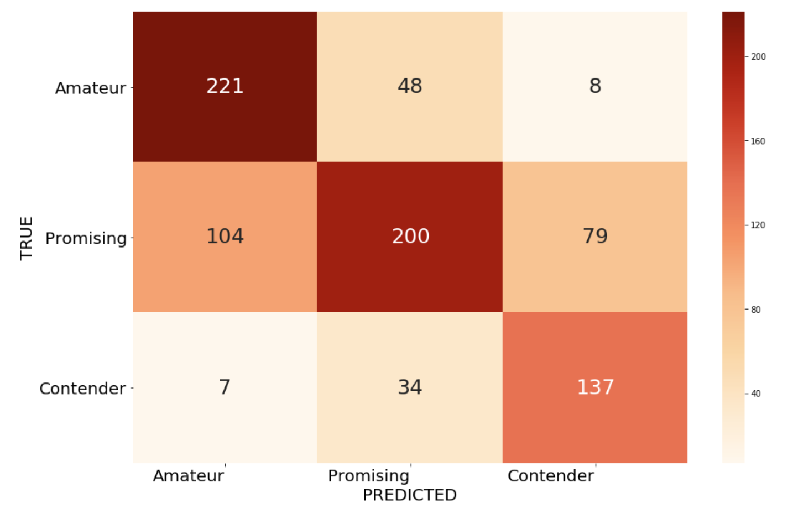
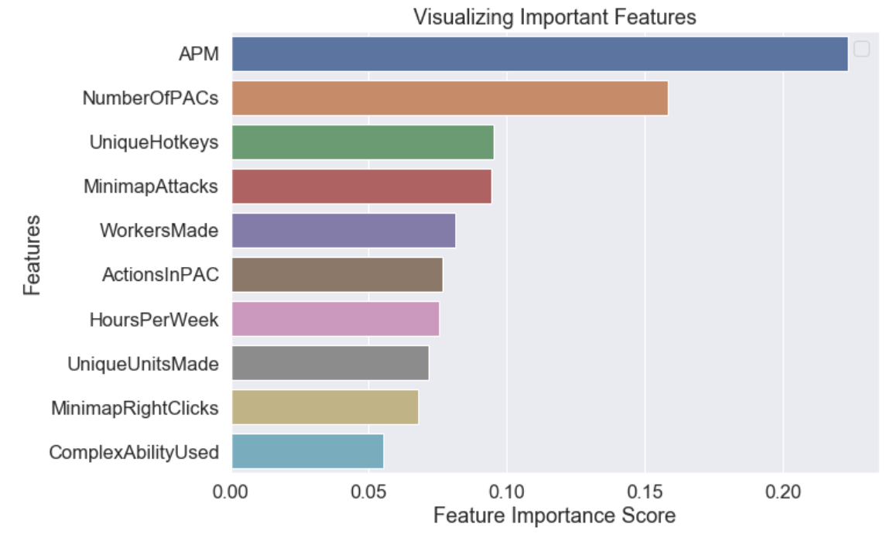

# Project McNulty: StarCraft Pro Scout

### Analysis: Torin Rettig

## 1. Proposal

eSports has become big business over the past couple of decades. Going from small Quake LAN tournaments in someone’s house to arena events with  thousands of spectators, streamed to 10s of millions of viewers, with multi-million dollar prizes to be won. StarCraft is the original eSport and continues to be popular to this day, generating over $37 million in winnings for its pro players.  

What if you could predict who the next big eSports player would be? StarCraft's competitive online multiplayer has a League system and players move up and down this 8 League system depending on their wins and losses in online games with other players. Far from being just a cool way to show how many opponents you've beaten, the StarCraft League system is where the best players compete for dominance to show their prowess and readiness to join the World Championship Series tournament circuit. At the top tiers of the Leagues membership is limited with the top percentage of players in a particular League being promoted up and the lower percentage being demoted down. The fierceness of the competition and caliber of players playing in the Leagues makes it a good gauge of who will do well in tournaments and win. 

Using classification and supervised modeling techniques the goal of this project is to create a model to accurately predict the StarCraft League of a player  through various objective measures of skill and ability. These variables that quantify skill were obtained from a dataset from a 2013 cognitive science study from Simon Fraser University, where they analyzed almost 3400 game replays of players in the League system, with players from all 8 Leagues having good representation in the dataset. 

An effective model for classifying players into Leagues based on their technical execution skills can allow eSports teams to scout promising pro players early to bolster the roster of their teams and increase revenue by winning tournaments. 

### Assumptions

- We will assume that the variables from the dataset are wide and varied enough to be able to determine both a player's skill and where they are placed in the StarCraft 2 Leagues system. Using my domain knowledge of StarCraft when I look at the variables being measured they seem like they will be very good and could have some interesting surprises. 
- We also assume that where a player is in the League system is a good gauge of their professional eSports potential. Because StarCraft 2 pro players actively participate in the League system and top players in that system are very successful at tournaments this should be a pretty safe assumption. 

### Methodology

- A dataset from a 2013 cognitive science study from Simon Fraser University called StarCraft2 Replay Analysis which measured players' technical abilities is the data source for the project. The variables from this dataset are used to attempt to create a model that will classify a player into their presumed StarCraft League. 
- Both parametric and non-parametric classificaiton techniques such as KNN, Support Vector Classifiers, Random Forests and Logistic Regression are used for the modeling process. 

### Data  

- The dataset for this project is from a 2013 cognitive science study from Simon Fraser University called StarCraft2 Replay Analysis. The dataset has almost 3400 observations and 20 variables which generally quantify a player's skill with the game by measuring various technical execution abilities. These range from how quickly a player can input commands, to the types and variety of units they create, to how quickly they respond to changing situations on the battlefied. 
- Each of the observations is one game from a unique individual player, so these are observations of roughly 3400 players. A very small number of entries that were from the same players got in to the dataset and were removed. 
- Target - Player League Rank
- Variables
  - GameID: Unique ID for each game
  - LeagueIndex: 1-8 for Bronze, Silver, Gold, Platinum, Diamond, Master, GrandMaster, Professional League
  - Age: Age of each player
  - HoursPerWeek: Hours spent playing per week
  - TotalHours: Total hours spent playing
  - APM: Action per minute
  - SelectByHotkeys: Number of unit selections made using hotkeys per timestamp
  - AssignToHotkeys: Number of units assigned to hotkeys per timestamp
  - UniqueHotkeys: Number of unique hotkeys used per timestamp
  - MinimapAttacks: Number of attack actions on minimal per timestamp
  - MinimapRightClicks: Number of right-clicks on minimal per timestamp
  - NumberOfPACs: Number of PACs per timestamp
  - GapBetweenPACs: Mean duration between PACs (milliseconds)
  - ActionLatency: Mean latency from the onset of PACs to their first action (milliseconds)
  - ActionsInPAC: Mean number of actions within each PAC
  - TotalMapExplored: Number of 24x24 game coordinate grids viewed by player per timestamp
  - WorkersMade: Number of SCVs, drones, probes trained per timestamp
  - UniqueUnitsMade: Unique units made per timestamp
  - ComplexUnitsMade: Number of ghosts, investors, and high templars trained per timestamp
  - ComplexAbilityUsed: Abilities requiring specific targeting instructions used per timestamp
  - MaxTimeStamp: Time stamp of game's last recorded event
- Data Files
  - Source Data File: /data/starcraft.csv
  - Data Documentation: /data/StarCraft2ReplayAnalysisDocumentation-1.pdf

## 2. Tools

- Python
- Jupyter Notebooks
- Pandas 
- Numpy
- Seaborn
- Matplotlib
- Scikit-learn

## 3. Data Cleaning

Source File: /notebooks/mcnulty_data_clean.ipynb

General data cleaning consisted of removing duplicate entires, dropping the GameID column, dealing with significant outliers and dealing with NaN values. 

Every observation was supposed to be from a unique player, but a few were from the same players. The researchers identified these specific entries, of which there were about 10, and left it to the users of the dataset to decide whether or not to use them. Because there were so few I decided to just take them out. 

Deciding what to do with outliers actually took quite a bit of time as they turned out to be a bit more varied than they initially seemed. The most egregious outliers were in the total hours played. There was one entry with a ridiculous total of 100k hours which is *most likely* erroneous, but in any case it was only one entry and not something we wanted to keep. There seemed to be some more natural extreme outliers though, well beyond the 1.5xIQR standard, but I didn't want to eliminate them all, since they seemed to be a natural part of the data set. I eliminated those that were 3xIQR and kept the rest. 

NaNs were a bit more troublesome. After investigating it turned out that they were limited to only about 56 observations, but they all came from the highest League players, League 8 (Pro). There were no entries for Age, TotalHours or HoursPerWeek for any of these players. I was very interested in these variables as factors in performance so I didn't want to drop these columns. I also didn't want to simply eliminate these observations, as that would remove all of the Pro players, effectively removing 1 of the 8 League, and arguably the League of greatest interest. 

After investigating I made a few calls on these: 

- Set the Age for these NaN entries to the mean age, as this was the least disruptive option when looking at the age distributions amongst the Leagues. 
- Set the HoursPerWeek to an assumed 9 hours per day. This was a judgement call, but I assume that Pro League players are spending a full workday at least playing the game. I actually assume they spend more time than this, but taking weekends and variance into account 9 hours seemed like a safe choice.
- For TotalHours I simply took the ratio of TotalHours divided by HoursPerWeek for the next closest League, League 7 (Grandmaster), and multiplied that by the 9 hour per day estimate above. Again since these are Pro players this seemed like fairly accurate way to get to a TotalHour count for Pro players. 

## 4. Feature Selection

Source File: /notebooks/mcnulty_eda.ipynb
Source File: /notebooks/mcnulty_data_clean.ipynb

Some interesting and challenging insights about the variable data led to some tough choices about which features to keep and which to remove. Overall, there were two issues with the data. One, most variables were not normally distributed and two there was pretty significant collinearity between a number of variables. 

Because most parametric methods depend on normally distributed data I went to great lengths to investigate the distribution of all of the variables. After employing histograms, Q-Q plots and the Yeo-Johnson method of numerically evaluating normality only 5 of the 19 variables had distributions that were normal and this is after attempting to square them, take the square root, standard scale them, log scale them, etc. Many of the variables just had a natural skew to them and mostly a right skew. This actually makes sense as the Leagues encompass a wide spectrum of players, from the casual players who might play a competitive game every once in a while to Pro gamers for whom StarCraft is their job and they win 100s of thousands of dollars by winning worldwide tournaments. In any case, for parametric models, I would only have a very small selection of potential features to choose from.

Collinearity was the other issue with the variables. There was a decent amount of it amongst around half of the variables. Like the normality issues these made a good deal of sense. Many variables are naturally related to each other. For instance ComplexUnitCreated and ComplexAbilityUsed are connected because you need to create a complex unit in order to use its ability. There were other apparent connections of this type and I ended up keeping only one of these collinear features in most cases. 

Ultimately I decided to split the dataset into two versions. One with 3 features for parametric models and another with 10 features for non-parametric models. 

#### Parametric Model Features
Taking both normality and multicollinearity into account
- APM
- NumberOfPACs
- UniqueUnitsMade

#### Non-Parametric Model Features
Only taking multicollinearity into account  
- HoursPerWeek
- APM
- UniqueHotkeys
- MinimapAttacks
- MinimapRightClicks
- NumberOfPACs
- ActionsInPAC
- WorkersMade
- UniqueUnitsMade
- ComplexAbilityUsed 

## 5. League Compression
Source File: /notebooks/mcnulty_compress_categories.ipynb
Another decision I made was to compress the League from 8 down to 3 groups of Leagues. 

__8 Leagues__

- Bronze
- Silver
- Gold
- Platinum
- Diamond
- Master
- Grandmaster
- Pro

__3 Categories__

- Amateur (Bronze, Silver, Gold)
- Promising (Platinum, Diamond)
- Contender (Master, Grandmaster, Pro)

I did this for a few reasons. One was because of the relatively small representation in the upper Leagues. These groups are naturally much smaller in the League system, but it does create some challenges for the analysis. Two, these top Leagues are actually the ones we're most interested. Knowing how the lower Leagues sort out is interesting, but ultimately we want to kno who has Pro potential. The level of play at the top Legues is all very high so knowing who falls into this much larger category is still very valuable. 

## 6. Modeling 

As mentioned above I ended up dividing the modeling into two categories, non-parametric and parametric, with a custom set of variables for each. Because there were many more variables to work with for non-parametric I ended up spending most of my time and effort with those.

Because, even with the compressed Leagues, we were dealing with a multi-classification problem I had to decide what metrics would be the most informative and what class(es) would be the most important to prioritize. I decided on making the Contender category, representing the top three Leagues, the overall target to optimize for and that Recall would be the metric to evaluate it. I decided on Recall because I didn't want to miss any potential Contender level players, even if that meant getting some false positive, lower tier players classified into that group. We don't want to miss the next potential star.

I also kept mean accuracy across classes in as a bit of a sanity check. While I think the model can tolerate much more inaccuracy for the other classes, I didn't want it to be completely useless for those classes either.

### Non-Parametric
Source File: /notebooks/mcnulty_modeling_non-parametric.ipynb

I explored K-Nearest Neighbors, Support Vector Classifiers, and Random Forests as the main non-parametric approaches. I tried many different variations and flavors of these approaches, including simple train/test/split, cross-validation and grid search approaches. The cross-validated approaches got us closer to more reliable scores on test and grid search helped to find optimal hyperparameters. 

All of these various approaches got incremental improvements, but the thing that made the biggest difference was oversampling. Another good side-effect of the compressed Leagues is that it reduced a good deal of the class imbalance, to the point where I thought that it might not matter. However, after using random oversampling to make all classes equal in the training process the scores for all approaches increased dramatically. 

Of the parametric approaches **Support Vectror Classifier** with a linear kernel performed the best, with a Contender class recall of **0.7697** and an Accuracy score of **0.6659**. Here is the confusion matrix for this approach: 

Though Random Forests didn't perform as well as I'd hoped, it did produce a valuable feature importance chart, that ranked the influence of each feature. 

This is very cool to see, but not very surprising. APM is Actions Per Minute, which is essentially how quickly you can input commands in the game. This is not usually a very useful metric for most competitive video games, but StarCraft is a game of intense multitasking and if you can't do it quickly and accurately you simply won't perform well, no matter how good your tactical or strategic capabilities are. APM has been used as a high-profile measure of technical skill in StarCraft and other real-time strategy games, and the importance of the feature here reinforces the idea that this is actually a good measure of ability. 

**Parametric**
Source File: /notebooks/modeling_parametric.ipynb

The only parametric approach I was able to try was Logistic Regression with grid search. Interestingly, this yielded a Recall score that was significantly *better* than SVC, at **0.8862**. However, I ended up not going with this approach because the Accuracy score was so much *worse* than than SVC, at **0.4678**.

## Modeling Conclusions

As mentioned above I decided that **Support Vector Classifier with a linear kernel** with **Recall: 0.7697** and **Accuracy: 0.6659**. While Recall is the most important I still wanted the model to be fairly useful for categorizing the other classes. It's interesting how much better Logistic Regression was for Recall though, and it would be worth exploring in the future. 

## 7. Future Work

Given more time I would definitely like to investigate parametric approaches more thoroughly. There may be more gains in Logistic Regression or other approaches that don't sacrifice Accuracy to the degree that it did in my initial explorations. I would also like to attempt to apply these methodologies and insights to other datasets of similar types of variables for other competitive games. 

I think there's definite potential for predictive power with the right variables and metrics and this can be very valuable both for the eSports scene and for game development purposes. Finding automated ways gauge player skill and respond programatically to optimize the experience would be extremely helpful for making better gaming experiences. 

## SQL
Source File: /notebooks/mcnulty_SQL.ipynb

Some of the data importing and manipulation was replicated in SQL in a Jupyter notebook as part of the SQL requirements for the project. See the file above. 